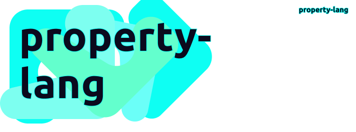
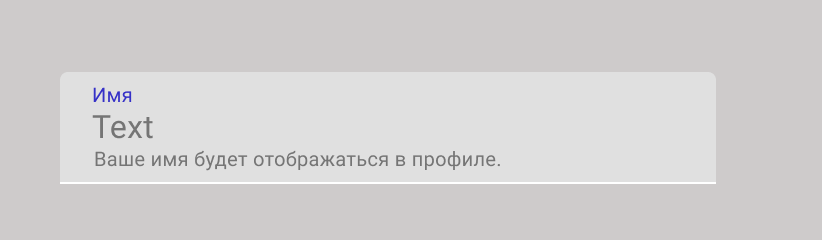

<h1>property-lang</h1>
 

 
## About property-lang
Это новый стандарт для валидации и генерации форм. 

Мне нравится идея Протобаф,единый язык описывает модели и сервисы, потом позволяет гененрировать код для разных фреймоврках на разных языках. Под капотом там наверника много усилий что бы релизовать всё под каждый язык. Но оно того стоит.

Хотелось бы что-то подобное иметь для валидации данных на бэке + верстке на фронтах.
Я вижу это как json файл с описанием модели и их свойств. Каждое свойство может быть инпутом во фронте, и иметь свою валидацию на бэкенде.
Хочу что бы код писал и валидировал сам, а лучше что бы его вообще не надо было писать и всё работало.

Базовый пример для фронта:
Текстовый инпут с лейблом и плейсхолдером. И в него можно ввести строку длинной 3-50 символов.

    {
    "key": "name",
    "label": "Имя",
    "type": "string",
    "min": 3,
    "max": 50, 
    "placeholder": "Введите ваше имя", 
    "description": "Ваше имя будет отображаться в профиле.",
    "prefix": null,
    "beforeIcon": "user-icon.svg",
    "tags": ["profile", "admin"],
    },

И пример модели в которую можно вписать этот инпут

    {
    "name": "ExampleModel",
    "label": "Пользователь",
    },

И например валидация входящих по модели по тегу **profile**

    error := PropertyLang.Validate(ExampleModel.Inputs.name, "text");
    if(error){ ...

    $error = PropertyLang.Validate(ExampleModel.Inputs.name, "text");
    if($error){ 

И свойства и модели были бы доступны как-то так:

    ExampleModel.Inputs.name [ PropertyLangModel Struct ]
    ExampleModel.Inputs.name.key
    ExampleModel.Inputs.name.label

# Теги

Теги это круто. У одной модели может быть 10 инпутов, и в разных случаях нам нужно принимать и валдировать разные инпуты.
Например пользователь редактирует свой профиль. И в определенной вкладке мы бы хотели дать ему возможность редактировать age, login, bio.
Для решения этой задачи можно добавить в нужные инпуты тэг tab_about_me

    "tags": ["profile", "admin", "tab_about_me"],

# Пример инпута

    {
    "key": "name",
    "type": "string",
    "min": 3,
    "max": 50,
    "required": true,
    "placeholder": "Введите ваше имя",
    "label": "Имя",
    "description": "Ваше имя будет отображаться в профиле.",
    "prefix": null,
    "postfix": null,
    "beforeIcon": "user-icon",
    "afterIcon": null,
    "defaultValue": null,
    "tags": ["profile", "admin"],
    "style": {
    "width": "100%",
    "color": "#333",
    "fontSize": "16px"
    },
    "options": null
    },

# Библиотеки

- Здесь будет го
- Здесь будет ангуляр
- Возможно php laravel
- Возможно rust
